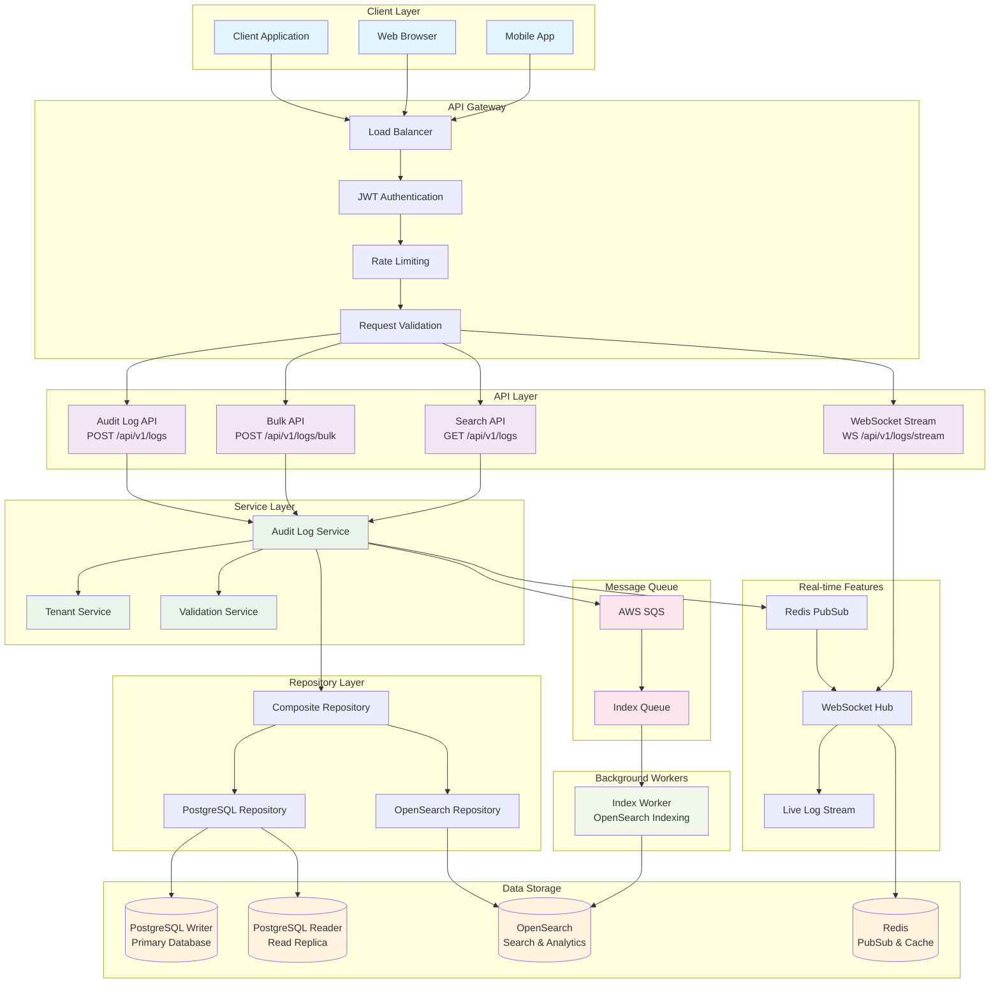
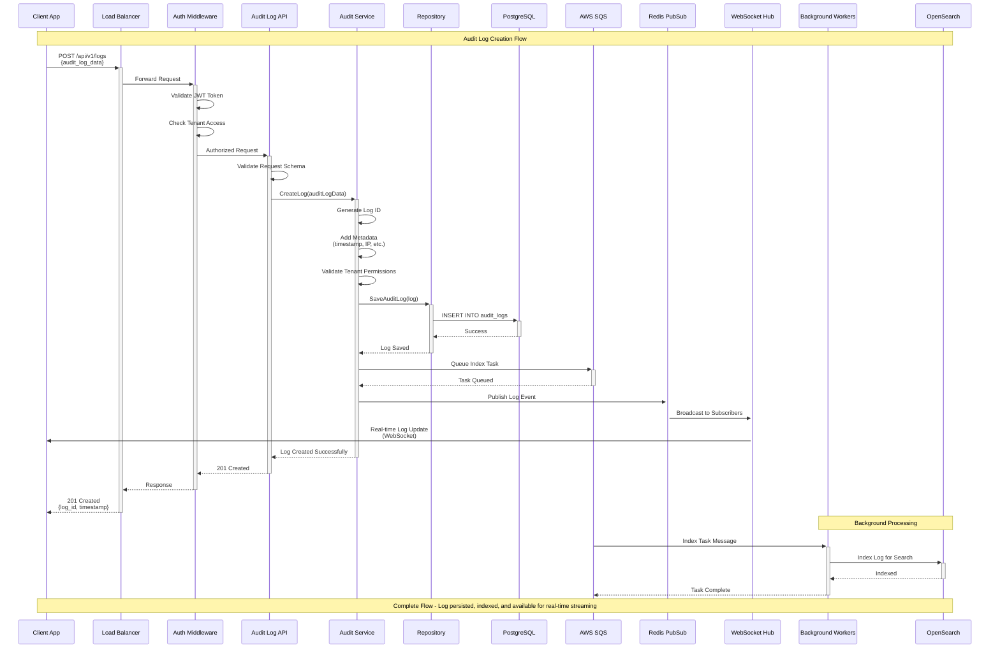
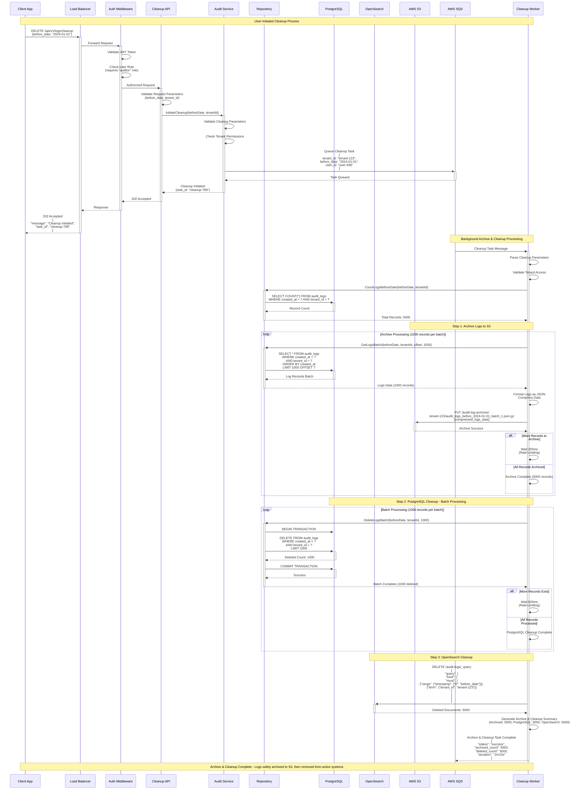

# Audit Log Flow Diagrams

This document provides comprehensive visual representations of the audit log system's architecture, request flow, and data lifecycle management.

## Overview

The audit log system is designed to handle high-volume logging with real-time processing, advanced search capabilities, and automated data lifecycle management. These diagrams illustrate the complete flow from API request to long-term storage.

---

## 1. System Architecture Overview

This diagram shows the complete system architecture and how all components interact with each other.

### Architecture Components

- **Client Layer**: Various client applications (web, mobile, API clients)
- **API Gateway**: Load balancing, authentication, rate limiting, and validation
- **API Layer**: RESTful endpoints and WebSocket streaming
- **Service Layer**: Business logic and orchestration
- **Repository Layer**: Data access abstraction
- **Message Queue**: Asynchronous indexing task processing via AWS SQS
- **Background Workers**: OpenSearch indexing worker for search functionality
- **Data Storage**: PostgreSQL, OpenSearch, and Redis for comprehensive data management
- **Real-time Features**: Live streaming and notifications

---

## 2. Create Log Flow Sequence

This sequence diagram shows the step-by-step process when creating an audit log entry.

### Flow Breakdown

1. **Request Processing**: Authentication, validation, and routing
2. **Immediate Storage**: Write to PostgreSQL for immediate availability
3. **Async Processing**: Queue background tasks for indexing
4. **Real-time Broadcasting**: Notify connected WebSocket clients
5. **Background Workers**: Process queued tasks asynchronously

---

## 3. Cleanup Flow Sequence

This sequence diagram shows the cleanup process triggered by a user API request to remove old audit logs.

### Archive & Cleanup Process Breakdown

1. **API Request**: User makes DELETE request to `/api/v1/logs/cleanup` with date parameter
2. **Authentication**: Validates JWT token and checks for "auditor" role permission
3. **Validation**: Validates cleanup parameters and tenant permissions
4. **Task Queuing**: Queues archive & cleanup task in SQS for background processing
5. **Immediate Response**: Returns 202 Accepted with task ID for status tracking
6. **Archive Phase**: Worker archives logs to S3 in compressed JSON format
7. **Cleanup Phase**: Removes archived records from PostgreSQL and OpenSearch
8. **Status Tracking**: Task completion status with archive and deletion counts
