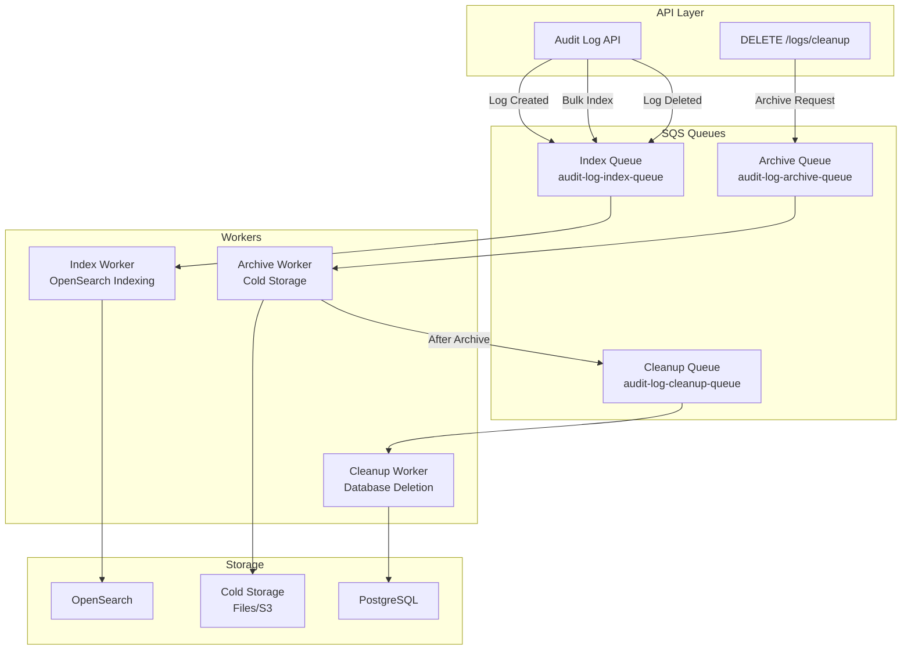

# Multi-Queue SQS Architecture

## Overview

The audit log API now uses **three separate SQS queues** for better isolation, scaling, and monitoring:

1. **Index Queue** - For log indexing operations (OpenSearch)
2. **Archive Queue** - For log archival operations  
3. **Cleanup Queue** - For log deletion operations

## Queue Configuration

### Environment Variables

```bash
# Index Queue (for log indexing to OpenSearch)
AWS_SQS_INDEX_QUEUE_URL=http://localhost:4566/000000000000/audit-log-index-queue

# Archive Queue (for log archival to cold storage)
AWS_SQS_ARCHIVE_QUEUE_URL=http://localhost:4566/000000000000/audit-log-archive-queue

# Cleanup Queue (for log deletion from database)
AWS_SQS_CLEANUP_QUEUE_URL=http://localhost:4566/000000000000/audit-log-cleanup-queue

# Legacy Queue (for backward compatibility)
AWS_SQS_QUEUE_URL=http://localhost:4566/000000000000/audit-log-queue
```

### Queue Attributes

| Queue | Visibility Timeout | Purpose | Message Retention |
|-------|-------------------|---------|-------------------|
| Index | 30 seconds | Fast indexing operations | 24 hours |
| Archive | 60 seconds | Longer archival operations | 24 hours |
| Cleanup | 60 seconds | Database cleanup operations | 24 hours |

## Architecture Flow



## Worker Operations

### 1. Index Worker (`cmd/worker/main.go`)
- **Queue**: `audit-log-index-queue`
- **Operations**: 
  - Index new logs to OpenSearch
  - Bulk index operations
- **Message Types**: `INDEX`, `BULK_INDEX`

### 2. Archive Worker (`cmd/archive-worker/main.go`)
- **Queue**: `audit-log-archive-queue`
- **Operations**:
  - Read logs from PostgreSQL before specified date
  - Write logs to cold storage (files/S3)
  - Enqueue cleanup message after successful archival
- **Message Types**: `ARCHIVE`

### 3. Cleanup Worker (`cmd/cleanup-worker/main.go`)
- **Queue**: `audit-log-cleanup-queue`
- **Operations**:
  - Delete logs from PostgreSQL before specified date
  - Only processes messages from successful archival
- **Message Types**: `CLEANUP`
